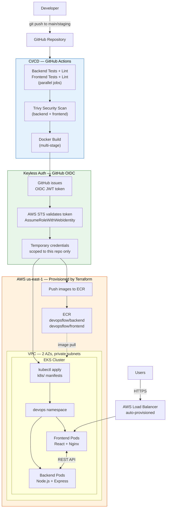

# DevOpsFlow-CICD-K8s

> **Built by [Rushi Patel](https://rushipatel.work) &mdash; [LinkedIn](https://linkedin.com/in/rushipatel) &middot; [Portfolio](https://rushipatel.work)**

A production-grade DevOps reference architecture demonstrating CI/CD pipelines, Kubernetes deployment, and security hardening &mdash; built entirely with open source tools.

[](/.github/workflows/ci-cd.yml)
[](https://aws.amazon.com)
[](https://terraform.io)
[](https://kubernetes.io)
[](https://helm.sh)
[](https://docker.com)
[](https://nodejs.org)
[](https://react.dev)
[](LICENSE)

---

## What This Project Demonstrates

End-to-end DevOps engineering covering every layer a production system needs:

| Layer | What's built |
|---|---|
| **App** | Node.js REST API + React SPA, containerized with multi-stage Docker builds |
| **Cloud** | AWS EKS cluster, ECR container registry, VPC networking &mdash; all provisioned via Terraform |
| **CI/CD** | GitHub Actions with OIDC keyless auth to AWS (+ Bitbucket Pipelines, Jenkins implementations) |
| **Kubernetes** | Namespace-isolated deployments, Ingress, Services, resource limits, health probes |
| **Helm** | Parameterized chart for multi-environment promotion |
| **Security** | GitHub OIDC (zero static credentials), Trivy scanning, OPA Gatekeeper, Pod Security Contexts, Vault, JWT auth |
| **Observability** | Prometheus + Grafana metrics, EFK log aggregation, Jaeger distributed tracing |

---

<!-- 
## Screenshots
TODO: Add screenshots to a screenshots/ folder and uncomment this section.
Suggested: Grafana dashboard, GitHub Actions pipeline run, ArgoCD sync view.

| CI/CD Pipeline | Kubernetes Dashboard | Observability |
|---|---|---|
|  |  |  |
-->

## Architecture — Live Flow

> Every step below runs automatically on `git push`. No static AWS credentials are stored anywhere.



**What happens on every push:**

| Step | What | How |
|---|---|---|
| 1 | Tests + lint run | Parallel jobs for backend and frontend |
| 2 | Security scan | Trivy checks for HIGH/CRITICAL CVEs |
| 3 | Docker build | Multi-stage build, cached via GitHub Actions cache |
| 4 | OIDC auth | GitHub issues a JWT, AWS validates it — zero secrets |
| 5 | Push images | Tagged with `sha-<commit>` to ECR |
| 6 | Deploy | `kubectl apply` to EKS via temporary OIDC credentials |
| 7 | Rollout wait | Pipeline blocks until pods are healthy |

---

## Repository Structure

```
DevOpsFlow-CICD-K8s/
├── .github/workflows/
│   └── ci-cd.yml              # GitHub Actions pipeline (OIDC → ECR → EKS)
├── terraform/
│   ├── main.tf                # AWS provider, data sources
│   ├── vpc.tf                 # VPC, subnets, NAT gateway
│   ├── eks.tf                 # EKS cluster, managed node group, access entries
│   ├── ecr.tf                 # ECR repositories + lifecycle policies
│   ├── iam-oidc.tf            # GitHub OIDC provider + IAM role + trust policy
│   ├── variables.tf           # Input variables with defaults
│   ├── outputs.tf             # Cluster endpoint, ECR URLs, role ARN
│   └── versions.tf            # Provider version constraints
├── backend/
│   ├── src/
│   │   ├── middleware/auth.js  # JWT auth + brute-force protection
│   │   └── routes/            # dashboard, logs, monitoring endpoints
│   ├── Dockerfile             # Multi-stage build
│   └── package.json
├── frontend/
│   ├── src/components/        # Dashboard, Login, Monitoring, Logs
│   ├── nginx/nginx.conf       # Reverse proxy config
│   ├── Dockerfile             # Multi-stage build
│   └── package.json
├── helm/
│   ├── templates/deployment.yaml
│   ├── Chart.yml
│   └── values.yml             # Parameterized for multi-env
├── k8s/
│   ├── namespace.yml
│   ├── deployment.yml         # Security contexts, resource limits
│   ├── backend-deployment.yml
│   ├── service.yml
│   └── ingress.yml            # AWS ALB annotations (commented)
├── bitbucket-pipelines.yml    # Bitbucket CI/CD
├── Jenkinsfile                # Jenkins declarative pipeline
└── flow-diagrams.md           # Extended architecture diagrams
```

---

## CI/CD Pipelines

Three parallel implementations — same outcome, different platforms — to show platform-agnostic DevOps skills.

### Pipeline Stages (all three platforms)

```
Code Push → Test (parallel) → Security Scan → Build & Push → Deploy Staging → [Approval] → Deploy Production
```

| Stage | What happens |
|---|---|
| **Test** | Unit tests + linting for backend and frontend (runs in parallel) |
| **Security Scan** | Trivy filesystem scan for CVEs |
| **Build** | Docker multi-stage build, push to container registry |
| **Deploy Staging** | OIDC auth → `aws eks update-kubeconfig` → `kubectl apply` on staging branch |
| **Deploy Production** | Same flow on main, requires manual approval via GitHub environment protection |

### Platform Comparison

| Feature | GitHub Actions | Bitbucket Pipelines | Jenkins |
|---|---|---|---|
| Hosting | Cloud | Cloud | Self-hosted |
| Config format | YAML | YAML | Groovy DSL |
| Container registry | ECR (via OIDC) | Docker Hub | Any |
| Parallelism | Job-level | Step-level | Stage-level |
| Secrets | GitHub Secrets | Repository Variables | Credentials plugin |
| Production approval | Environment protection rules | Deployment permissions | Input step |

---

## Getting Started

### Prerequisites

- Docker 20.x+
- Kubernetes 1.24+ (Minikube, k3s, or kind for local)
- Helm 3.x
- Node.js 18.x+
- AWS CLI v2 + Terraform >= 1.5 (for AWS deployment)

### Local Development

```bash
# Backend
cd backend && npm install && npm start

# Frontend (separate terminal)
cd frontend && npm install && npm start
```

### Docker

```bash
# Backend
docker build -t backend:latest  ./backend
docker run -p 5000:5000 backend:latest

# Frontend
docker build -t frontend:latest ./frontend
docker run -p 80:80 frontend:latest
```

### Kubernetes

```bash
# Deploy
kubectl apply -f k8s/namespace.yml
kubectl apply -f k8s/

# Verify
kubectl get pods -n devops
kubectl get svc   -n devops
```

### Helm

```bash
helm install devops-flow ./helm --namespace devops
```

### Test the API

```bash
# Get a token
curl -X POST http://localhost:5000/api/auth/login \
  -H "Content-Type: application/json" \
  -d '{"username":"admin","password":"password"}'

# Hit a protected route
curl http://localhost:5000/api/dashboard \
  -H "Authorization: Bearer <token>"
```

---

## AWS Infrastructure

The project deploys to AWS EKS using **GitHub OIDC** for keyless authentication — no static AWS credentials stored anywhere.

### Provision with Terraform

```bash
cd terraform
terraform init
terraform plan
terraform apply
```

This creates: VPC (2 AZs, public/private subnets, NAT gateway), EKS cluster (2x t3.medium nodes), ECR repositories, and the IAM OIDC trust for GitHub Actions.

### Configure GitHub

1. Get the role ARN:
   ```bash
   terraform output github_actions_role_arn
   ```
2. In your GitHub repo: **Settings > Secrets and variables > Actions > Variables**
   - Add `AWS_ROLE_ARN` = the role ARN from step 1
3. Create environments in **Settings > Environments**:
   - `staging` — no protection rules
   - `production` — add required reviewers, restrict to `main` branch

No AWS secrets needed. GitHub OIDC handles authentication automatically.

### Connect locally

```bash
aws eks update-kubeconfig --region us-east-1 --name devopsflow
kubectl get nodes
```

### Cost estimate

| Resource | Cost |
|---|---|
| EKS control plane | ~$73/mo |
| 2x t3.medium nodes | ~$61/mo |
| NAT Gateway | ~$33/mo |
| **Total** | **~$167/mo** |

> Run `terraform destroy` when not in use. For screenshots, spin up → capture → destroy in under an hour (<$1).

---

## Security Highlights

Security is applied at every layer, not bolted on at the end:

**Application layer**
- JWT authentication with constant-time comparison (prevents timing attacks)
- Rate limiting on auth endpoints (brute-force protection)
- Strict CSP, HSTS, XSS headers
- CORS and payload size restrictions

**Container layer**
- Multi-stage Docker builds (minimal attack surface)
- Trivy CVE scanning in every pipeline run
- Images run as non-root user

**Kubernetes layer**
- `runAsNonRoot: true` + `readOnlyRootFilesystem: true`
- All Linux capabilities dropped (`drop: ["ALL"]`)
- RuntimeDefault seccomp profile
- Resource limits on every container
- Liveness and readiness probes

**Cluster layer**
- OPA Gatekeeper admission policies
- Kubernetes RBAC
- HashiCorp Vault for secret injection
- Falco runtime threat detection

---

## Observability Stack

```bash
# Prometheus + Grafana
helm repo add prometheus-community https://prometheus-community.github.io/helm-charts
helm install prometheus prometheus-community/kube-prometheus-stack
kubectl port-forward svc/prometheus-grafana 3000:80

# EFK (Elasticsearch + Fluentd + Kibana)
helm repo add elastic https://helm.elastic.co
helm install elasticsearch elastic/elasticsearch
helm install kibana        elastic/kibana
helm repo add fluent https://fluent.github.io/helm-charts
helm install fluentd fluent/fluentd
```

Metrics flow: `App pods → Prometheus → Grafana dashboards + Alertmanager`
Log flow: `App pods → Fluentd → Elasticsearch → Kibana`
Traces: `App → Jaeger` (OpenTelemetry compatible)

---

## Troubleshooting

**Pod not starting**
```bash
kubectl logs        <pod> -n devops
kubectl describe pod <pod> -n devops
```

**Service not reachable**
```bash
kubectl get svc       -n devops
kubectl get endpoints -n devops
```

**Pipeline failing**
- Verify `AWS_ROLE_ARN` variable is set in GitHub repo settings
- OIDC error (`Could not assume role`): check the trust policy `sub` claim matches your repo
- ECR auth failure: ensure `ecr:GetAuthorizationToken` is in the IAM policy
- EKS `Unauthorized`: verify the access entry exists and `authentication_mode` includes `API`
- Review Trivy scan output for blocking CVEs

**Auth errors**
- Token format must be `Authorization: Bearer <token>`
- Check for rate-limit lockout (5 failed attempts triggers cooldown)

---

## Tools & Technologies

| Category | Tools |
|---|---|
| **App** | Node.js, Express, React, Nginx |
| **Cloud** | AWS (EKS, ECR, VPC, IAM) |
| **IaC** | Terraform |
| **Containers** | Docker (multi-stage builds) |
| **Orchestration** | Kubernetes, Helm |
| **CI/CD** | GitHub Actions (OIDC), Bitbucket Pipelines, Jenkins |
| **Security** | GitHub OIDC, Trivy, OPA Gatekeeper, HashiCorp Vault, Falco |
| **Observability** | Prometheus, Grafana, Elasticsearch, Fluentd, Kibana, Jaeger |

---

## Contributing

1. Fork the repository
2. Create a feature branch (`git checkout -b feature/my-change`)
3. Commit your changes
4. Open a pull request

---

## License

MIT

---

> **Rushi Patel** &mdash; DevOps & Platform Engineer
> [rushipatel.work](https://rushipatel.work) &middot; [LinkedIn](https://linkedin.com/in/rushipatel) &middot; Available for freelance engagements
