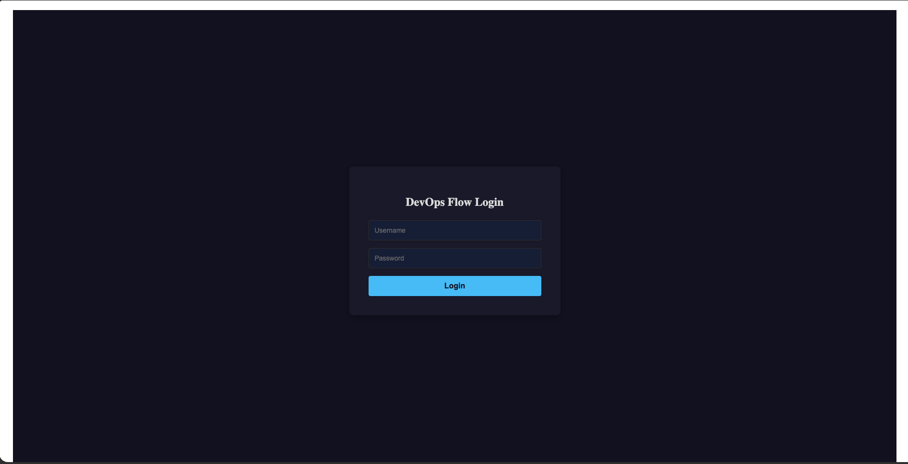
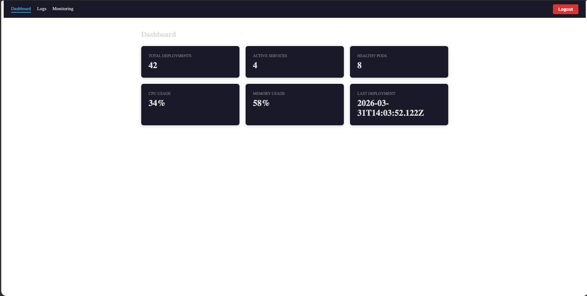
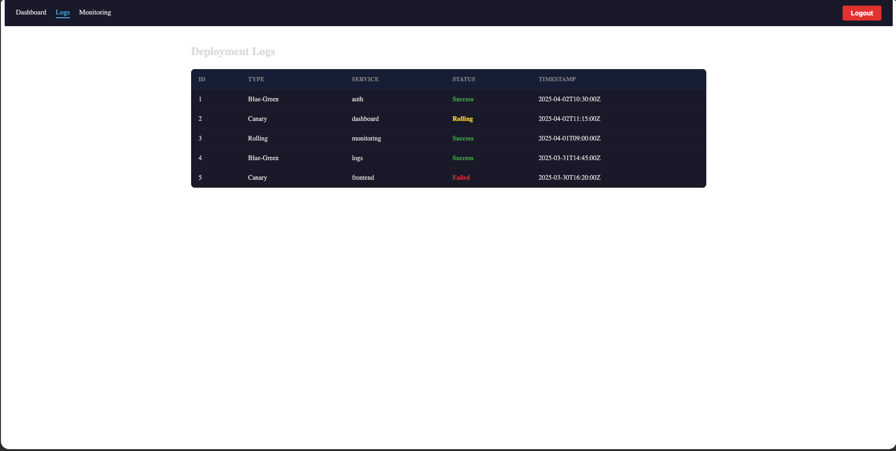
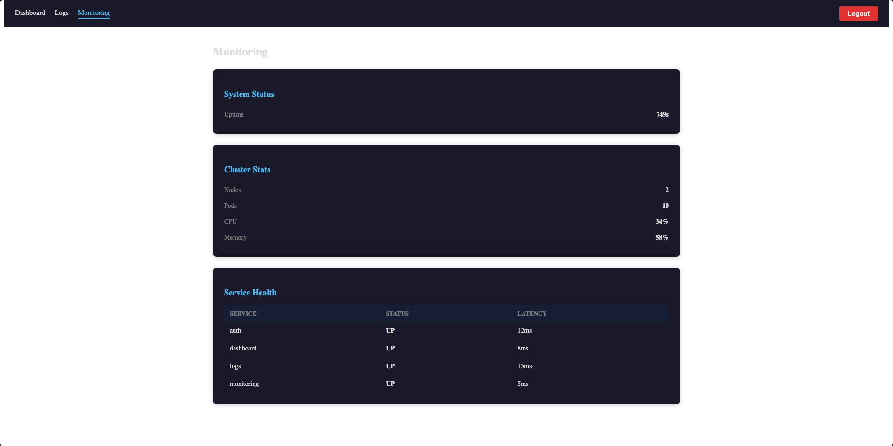
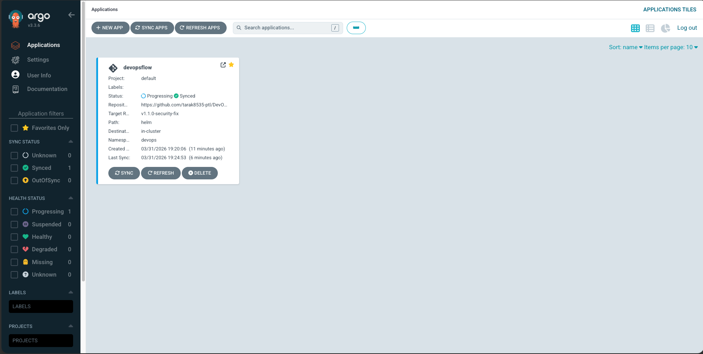
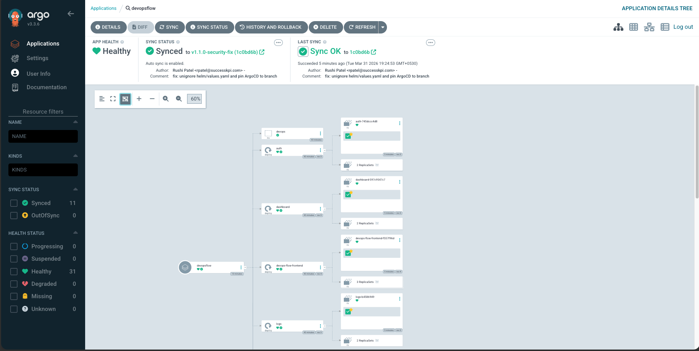
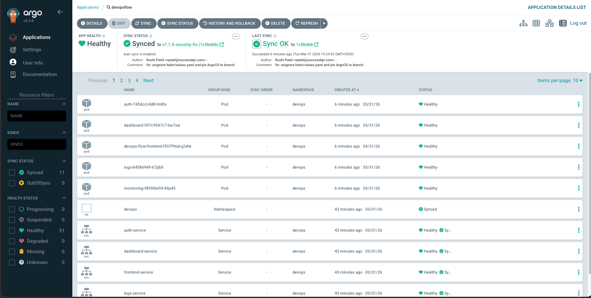
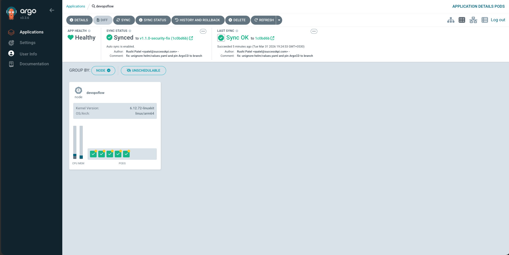
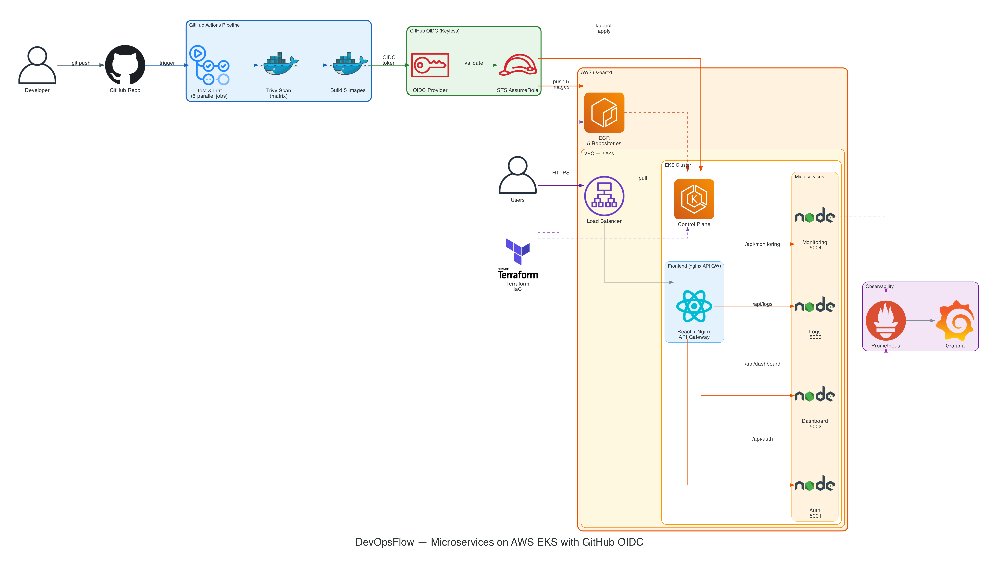

# DevOpsFlow-CICD-K8s

> **Built by [Rushi Patel](https://rushipatel.work) &mdash; [LinkedIn](https://linkedin.com/in/rushipatel) &middot; [Portfolio](https://rushipatel.work)**

A production-grade DevOps reference architecture demonstrating CI/CD pipelines, Kubernetes deployment, and security hardening &mdash; built entirely with open source tools.

[](/.github/workflows/ci-cd.yml)
[](https://aws.amazon.com)
[](https://terraform.io)
[](https://kubernetes.io)
[](https://helm.sh)
[](https://docker.com)
[](https://nodejs.org)
[](https://react.dev)
[](LICENSE)

---

## What This Project Demonstrates

End-to-end DevOps engineering covering every layer a production system needs:

| Layer | What's built |
|---|---|
| **App** | 4 Node.js microservices (Auth, Dashboard, Logs, Monitoring) + React SPA with nginx API gateway |
| **Cloud** | AWS EKS cluster, ECR container registry, VPC networking &mdash; all provisioned via Terraform |
| **CI/CD** | GitHub Actions with OIDC keyless auth to AWS + Bitbucket Pipelines |
| **Kubernetes** | Namespace-isolated deployments, Ingress, Services, resource limits, health probes |
| **Helm** | Parameterized chart for multi-environment promotion |
| **Security** | GitHub OIDC (zero static credentials), Trivy scanning, OPA Gatekeeper, Pod Security Contexts, Vault, JWT auth |
| **Observability** | Prometheus + Grafana metrics, EFK log aggregation, Jaeger distributed tracing |

---

## Screenshots

### Application

| Login | Dashboard | Deployment Logs | Monitoring |
|---|---|---|---|
|  |  |  |  |

### ArgoCD GitOps

| App Overview | Resource Tree | Resources List | Pod View |
|---|---|---|---|
|  |  |  |  |

## Architecture — Live Flow

> Every step runs automatically on `git push`. No static AWS credentials stored anywhere.
> Open the [SVG version](diagrams/architecture.svg) for **animated flow lines**.



| Step | What | How |
|---|---|---|
| 1 | git push | Triggers GitHub Actions workflow |
| 2 | Test & Scan | Parallel lint/test + Trivy CVE scan |
| 3 | OIDC Auth | GitHub issues JWT, AWS STS validates — zero secrets |
| 4 | Push images | Tagged `sha-<commit>` to ECR |
| 5 | Deploy | `kubectl apply` to EKS via temporary credentials |
| 6 | Live | Users reach the app through AWS Load Balancer |

---

## Repository Structure

```
DevOpsFlow-CICD-K8s/
├── .github/workflows/
│   └── ci-cd.yml              # GitHub Actions pipeline (OIDC → ECR → EKS)
├── terraform/
│   ├── main.tf                # AWS provider, data sources
│   ├── vpc.tf                 # VPC, subnets, NAT gateway
│   ├── eks.tf                 # EKS cluster, managed node group, access entries
│   ├── ecr.tf                 # ECR repositories + lifecycle policies
│   ├── iam-oidc.tf            # GitHub OIDC provider + IAM role + trust policy
│   ├── variables.tf           # Input variables with defaults
│   ├── outputs.tf             # Cluster endpoint, ECR URLs, role ARN
│   └── versions.tf            # Provider version constraints
├── backend/
│   ├── src/
│   │   ├── middleware/auth.js  # JWT auth + brute-force protection
│   │   └── routes/            # dashboard, logs, monitoring endpoints
│   ├── Dockerfile             # Multi-stage build
│   └── package.json
├── frontend/
│   ├── src/components/        # Dashboard, Login, Monitoring, Logs
│   ├── nginx/nginx.conf       # API gateway (routes to microservices)
│   ├── Dockerfile             # Multi-stage build
│   └── package.json
├── services/
│   ├── auth/                  # Auth microservice (:5001)
│   ├── dashboard/             # Dashboard microservice (:5002)
│   ├── logs/                  # Logs microservice (:5003)
│   └── monitoring/            # Monitoring microservice (:5004)
├── helm/
│   ├── templates/deployment.yaml
│   ├── Chart.yml
│   └── values.yml
├── k8s/
│   ├── namespace.yml
│   ├── deployment.yml         # Frontend deployment
│   ├── auth-deployment.yml    # Auth service deployment
│   ├── dashboard-deployment.yml
│   ├── logs-deployment.yml
│   ├── monitoring-deployment.yml
│   ├── *-service.yml          # ClusterIP services per microservice
│   ├── frontend-service.yml   # LoadBalancer for frontend
│   └── ingress.yml
├── bitbucket-pipelines.yml    # Bitbucket CI/CD
└── diagrams/                  # Architecture diagram (Python + PNG)
```

---

## CI/CD Pipelines

Two parallel implementations — same outcome, different platforms — to show platform-agnostic DevOps skills.

### Pipeline Stages (both platforms)

```
Code Push → Test (parallel) → Security Scan → Build & Push → Deploy Staging → [Approval] → Deploy Production
```

| Stage | What happens |
|---|---|
| **Test** | Unit tests + linting per microservice + frontend (all parallel) |
| **Security Scan** | Trivy filesystem scan for CVEs |
| **Build** | Docker multi-stage build, push to container registry |
| **Deploy Staging** | OIDC auth → `aws eks update-kubeconfig` → `kubectl apply` on staging branch |
| **Deploy Production** | Same flow on main, requires manual approval via GitHub environment protection |

### Platform Comparison

| Feature | GitHub Actions | Bitbucket Pipelines |
|---|---|---|
| Hosting | Cloud | Cloud |
| Config format | YAML | YAML |
| Container registry | ECR (via OIDC) | Docker Hub |
| Parallelism | Job-level | Step-level |
| Secrets | GitHub Secrets | Repository Variables |
| Production approval | Environment protection rules | Deployment permissions |

---

## Getting Started

### Prerequisites

- Docker 20.x+
- Kubernetes 1.24+ (Minikube, k3s, or kind for local)
- Helm 3.x
- Node.js 18.x+
- AWS CLI v2 + Terraform >= 1.5 (for AWS deployment)

### Option 1: Docker Compose (quickest)

```bash
docker compose up --build
# App: http://localhost:80
```

### Option 2: Local K8s + Helm + ArgoCD (full stack)

Runs a kind cluster with all 5 microservices deployed via Helm, plus ArgoCD for GitOps.

```bash
# Prerequisites: docker, kind, kubectl, helm
brew install kind helm   # if not installed

# One command to set up everything
./scripts/local-setup.sh
```

This script:
1. Creates a kind cluster with port mappings
2. Builds all 5 Docker images locally
3. Loads images into the kind cluster
4. Deploys microservices via Helm chart
5. Installs ArgoCD with automated sync

**Access:**
| Service | URL |
|---|---|
| App | http://localhost:30080 |
| ArgoCD UI | https://localhost:8080 (after port-forward) |

```bash
# Open ArgoCD UI
kubectl port-forward svc/argocd-server -n argocd 8080:443

# Check pods
kubectl get pods -n devops

# Teardown
./scripts/local-teardown.sh
```

### Test the API

```bash
# Login
curl -X POST http://localhost:30080/api/auth/login \
  -H "Content-Type: application/json" \
  -d '{"username":"admin","password":"password"}'

# Hit a protected route
curl http://localhost:30080/api/dashboard \
  -H "Authorization: Bearer fake-jwt-token"
```

---

## AWS Infrastructure

The project deploys to AWS EKS using **OIDC keyless authentication** — no static AWS credentials stored anywhere. Both GitHub Actions and Bitbucket Pipelines are supported.

### Provision with Terraform

```bash
cd terraform
terraform init
terraform plan
terraform apply
```

This creates: VPC (2 AZs, public/private subnets, NAT gateway), EKS cluster (2x t3.medium nodes), ECR repositories, and the IAM OIDC provider + role.

### How OIDC Works

```
CI/CD pipeline → requests OIDC JWT token → AWS STS validates token → returns temporary credentials → deploy to EKS
```

No static `AWS_ACCESS_KEY_ID` or `AWS_SECRET_ACCESS_KEY` needed. The IAM trust policy in `terraform/iam-oidc.tf` restricts which repos and branches can assume the role.

---

### Configure GitHub Actions OIDC

**Step 1: Create the OIDC Identity Provider in AWS**

Terraform handles this automatically (`terraform/iam-oidc.tf`), but here's what it creates:

| Setting | Value |
|---|---|
| Provider URL | `https://token.actions.githubusercontent.com` |
| Audience | `sts.amazonaws.com` |
| Thumbprint | `ffffffffffffffffffffffffffffffffffffffff` (AWS ignores this for GitHub) |

**Step 2: Create the IAM Role**

Terraform creates `devopsflow-github-actions` role with this trust policy:

```json
{
  "Effect": "Allow",
  "Principal": {
    "Federated": "arn:aws:iam::<ACCOUNT_ID>:oidc-provider/token.actions.githubusercontent.com"
  },
  "Action": "sts:AssumeRoleWithWebIdentity",
  "Condition": {
    "StringEquals": {
      "token.actions.githubusercontent.com:aud": "sts.amazonaws.com"
    },
    "StringLike": {
      "token.actions.githubusercontent.com:sub": "repo:tarak8535-ptl/DevOpsFlow-CICD-K8s:*"
    }
  }
}
```

The `sub` claim scopes access to this specific repo. The `*` wildcard allows all branches and environments.

**Step 3: Attach Permissions to the Role**

The role gets two inline policies (both in `terraform/iam-oidc.tf`):

- **ECR push**: `ecr:PutImage`, `ecr:InitiateLayerUpload`, etc. — scoped to the 5 ECR repos
- **EKS access**: `eks:DescribeCluster` — for `aws eks update-kubeconfig`

Kubernetes-level auth is handled by the EKS access entry in `terraform/eks.tf`.

**Step 4: Configure GitHub Repo**

1. Get the role ARN after `terraform apply`:
   ```bash
   terraform output github_actions_role_arn
   ```
2. Go to **Settings > Secrets and variables > Actions > Variables**
   - Add variable: `AWS_ROLE_ARN` = the role ARN from step 1
3. Create environments in **Settings > Environments**:
   - `staging` — no protection rules (auto-deploy on staging branch)
   - `production` — add required reviewers, restrict to `main` branch

**Step 5: Workflow Usage**

The workflow uses `aws-actions/configure-aws-credentials@v4` with `id-token: write` permission:

```yaml
permissions:
  id-token: write  # Required for OIDC
steps:
  - uses: aws-actions/configure-aws-credentials@v4
    with:
      role-to-assume: ${{ vars.AWS_ROLE_ARN }}
      aws-region: us-east-1
```

No secrets needed — just the role ARN as a variable.

---

### Configure Bitbucket Pipelines OIDC

**Step 1: Enable OIDC in Bitbucket**

1. Go to **Repository settings > OpenID Connect**
2. Copy the **Identity Provider URL** (e.g., `https://api.bitbucket.org/2.0/workspaces/<WORKSPACE>/pipelines-config/identity/oidc`)
3. Copy the **Audience** value (the repo UUID)

**Step 2: Create the IAM OIDC Provider for Bitbucket**

Add to `terraform/iam-oidc.tf` (or create via AWS Console):

```hcl
resource "aws_iam_openid_connect_provider" "bitbucket" {
  url             = "https://api.bitbucket.org/2.0/workspaces/<WORKSPACE>/pipelines-config/identity/oidc"
  client_id_list  = ["ari:cloud:bitbucket::workspace/<WORKSPACE_UUID>"]
  thumbprint_list = ["ffffffffffffffffffffffffffffffffffffffff"]
}
```

**Step 3: Create IAM Role for Bitbucket**

```hcl
resource "aws_iam_role" "bitbucket_pipelines" {
  name = "devopsflow-bitbucket-pipelines"

  assume_role_policy = jsonencode({
    Version = "2012-10-17"
    Statement = [{
      Effect = "Allow"
      Principal = {
        Federated = aws_iam_openid_connect_provider.bitbucket.arn
      }
      Action = "sts:AssumeRoleWithWebIdentity"
      Condition = {
        StringLike = {
          "${aws_iam_openid_connect_provider.bitbucket.url}:sub" = "<REPO_UUID>:*"
        }
      }
    }]
  })
}
```

Attach the same ECR push + EKS access policies as the GitHub role.

**Step 4: Configure Bitbucket Repo**

1. Go to **Repository settings > Repository variables**
   - Add `AWS_ROLE_ARN` = the Bitbucket IAM role ARN
   - Add `AWS_OIDC_ROLE_ARN` = same value (used by the OIDC pipe)
2. Create **Deployment environments** in **Repository settings > Deployments**:
   - `staging` — auto-deploy
   - `production` — manual trigger

**Step 5: Pipeline Usage**

```yaml
- step:
    name: Deploy
    oidc: true  # Enables OIDC token
    script:
      - pipe: atlassian/aws-oidc-token:1.0.0
        variables:
          AWS_OIDC_ROLE_ARN: $AWS_OIDC_ROLE_ARN
      - aws eks update-kubeconfig --name devopsflow --region us-east-1
      - helm upgrade --install devopsflow ./helm --namespace devops
```

---

### Connect locally

```bash
aws eks update-kubeconfig --region us-east-1 --name devopsflow
kubectl get nodes
```

### Cost estimate

| Resource | Cost |
|---|---|
| EKS control plane | ~$73/mo |
| 2x t3.medium nodes | ~$61/mo |
| NAT Gateway | ~$33/mo |
| **Total** | **~$167/mo** |

> Run `terraform destroy` when not in use. For screenshots, spin up → capture → destroy in under an hour (<$1).

---

## Security Highlights

Security is applied at every layer, not bolted on at the end:

**Application layer**
- JWT authentication with constant-time comparison (prevents timing attacks)
- Rate limiting on auth endpoints (brute-force protection)
- Strict CSP, HSTS, XSS headers
- CORS and payload size restrictions

**Container layer**
- Multi-stage Docker builds (minimal attack surface)
- Trivy CVE scanning in every pipeline run
- Images run as non-root user

**Kubernetes layer**
- `runAsNonRoot: true` + `readOnlyRootFilesystem: true`
- All Linux capabilities dropped (`drop: ["ALL"]`)
- RuntimeDefault seccomp profile
- Resource limits on every container
- Liveness and readiness probes

**Cluster layer**
- OPA Gatekeeper admission policies
- Kubernetes RBAC
- HashiCorp Vault for secret injection
- Falco runtime threat detection

---

## Observability Stack

```bash
# Prometheus + Grafana
helm repo add prometheus-community https://prometheus-community.github.io/helm-charts
helm install prometheus prometheus-community/kube-prometheus-stack
kubectl port-forward svc/prometheus-grafana 3000:80

# EFK (Elasticsearch + Fluentd + Kibana)
helm repo add elastic https://helm.elastic.co
helm install elasticsearch elastic/elasticsearch
helm install kibana        elastic/kibana
helm repo add fluent https://fluent.github.io/helm-charts
helm install fluentd fluent/fluentd
```

Metrics flow: `App pods → Prometheus → Grafana dashboards + Alertmanager`
Log flow: `App pods → Fluentd → Elasticsearch → Kibana`
Traces: `App → Jaeger` (OpenTelemetry compatible)

---

## Troubleshooting

**Pod not starting**
```bash
kubectl logs        <pod> -n devops
kubectl describe pod <pod> -n devops
```

**Service not reachable**
```bash
kubectl get svc       -n devops
kubectl get endpoints -n devops
```

**Pipeline failing**
- Verify `AWS_ROLE_ARN` variable is set in GitHub repo settings
- OIDC error (`Could not assume role`): check the trust policy `sub` claim matches your repo
- ECR auth failure: ensure `ecr:GetAuthorizationToken` is in the IAM policy
- EKS `Unauthorized`: verify the access entry exists and `authentication_mode` includes `API`
- Review Trivy scan output for blocking CVEs

**Auth errors**
- Token format must be `Authorization: Bearer <token>`
- Check for rate-limit lockout (5 failed attempts triggers cooldown)

---

## Tools & Technologies

| Category | Tools |
|---|---|
| **App** | Node.js, Express, React, Nginx |
| **Cloud** | AWS (EKS, ECR, VPC, IAM) |
| **IaC** | Terraform |
| **Containers** | Docker (multi-stage builds) |
| **Orchestration** | Kubernetes, Helm |
| **CI/CD** | GitHub Actions (OIDC), Bitbucket Pipelines |
| **Security** | GitHub OIDC, Trivy, OPA Gatekeeper, HashiCorp Vault, Falco |
| **Observability** | Prometheus, Grafana, Elasticsearch, Fluentd, Kibana, Jaeger |

---

## Contributing

1. Fork the repository
2. Create a feature branch (`git checkout -b feature/my-change`)
3. Commit your changes
4. Open a pull request

---

## License

MIT

---

> **Rushi Patel** &mdash; DevOps & Platform Engineer
> [rushipatel.work](https://rushipatel.work) &middot; [LinkedIn](https://linkedin.com/in/rushipatel) &middot; Available for freelance engagements
